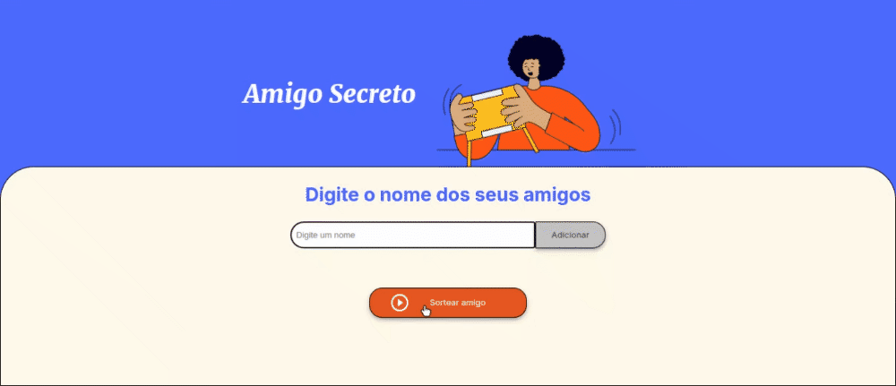
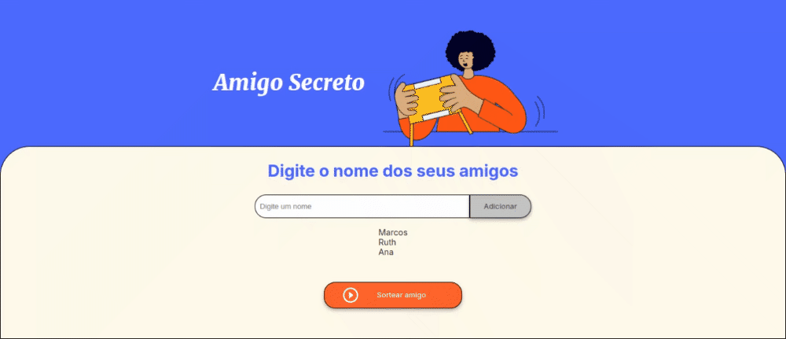

<h1>Desafio do amigo secreto</h1>

<h2>Sobre o Desafio</h2>

Projeto utilizado nos cursos de lógica de programação da Alura.
Uma aplicação que permite aos usuários inserir nomes de  amigos em uma lista para, em seguida, realizar um sorteio aleatório e determinar quem é o "amigo secreto".

  

  
  
  

## Funcionalidades

- **adicionarAmigo()**: Função usada para adicionar amigos na lista.
- **limparCampo()**: Função usada para limpar o campo de entrada da lista de amigos ao inserir um novo amigo.
- **atualizarListaDeAmigos()**: Função usada para atualizar a lista de amigos adicionados na tela.
- **sortearAmigo()**: Função usada para sortear um amigo da lista de amigos criados.

## Demonstração da aplicação

Para começar insira o nome de um amigo no campo "Insira um nome" usando o botão "Adicionar". Adicione quantos amigos quiser!

  

Após terminar de inserir seus amigos, clique no botão "Sortear amigo". Um amigo aleatório será sorteado para ser o amigo secreto.

  

